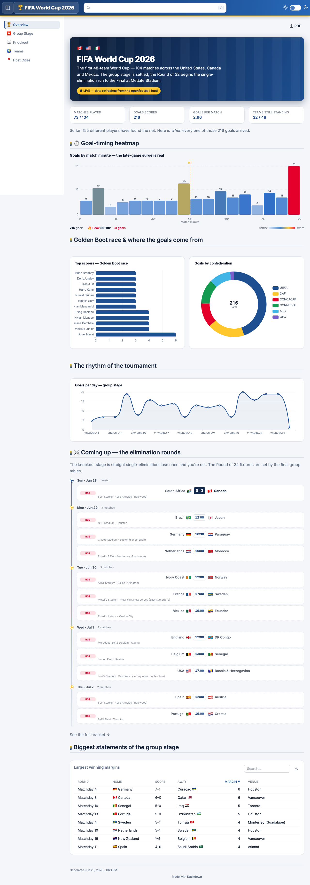
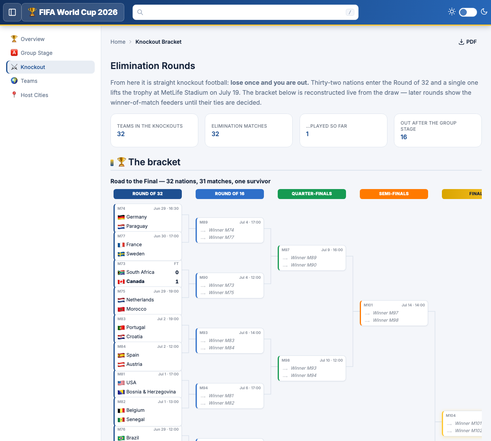
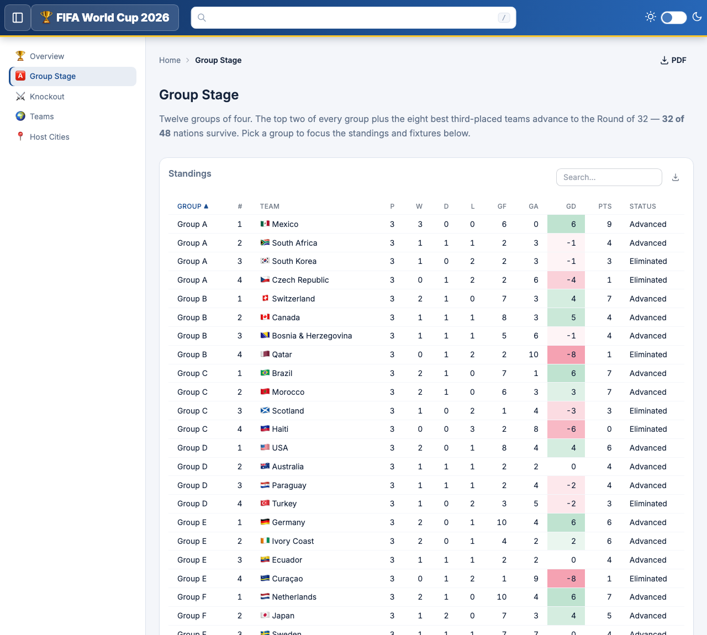

# FIFA World Cup 2026 — Dashdown Dashboard

An interactive analytics dashboard for the **2026 FIFA World Cup**, built with
[Dashdown](https://github.com/DirendAI/dashdown) and deployed to GitHub Pages.
Data is pulled live from the open-source [openfootball](https://github.com/openfootball/worldcup.json)
feed and pre-rendered into a fully static site — no backend, no JS framework, no npm.

**▶︎ Live demo: https://direndai.github.io/dashdown-world-cup-demo/**

<p align="center">
  
</p>

## What's inside

A page is just Markdown with embedded SQL and `<Component />` tags. This project has five:

| Page | What it shows |
| --- | --- |
| **Overview** (`/`) | Tournament pulse — goal-timing heatmap, the Golden Boot race, goals by confederation, scoring rhythm, and upcoming Round-of-32 fixtures. |
| **Group Stage** (`/groups`) | All twelve group tables with conditional formatting and who advanced. |
| **Knockout** (`/knockout`) | The full single-elimination bracket plus the knockout schedule. |
| **Teams** (`/teams`) | Every nation, click through to a per-team profile (`/teams/{code}`). |
| **Host Cities** (`/venues`) | The 16 host venues across the USA, Canada and Mexico. |

<p align="center">
  
  &nbsp;
  
</p>

## How it's built

- **Data** — a small custom connector (`components/worldcup_connector.py`) turns the
  live openfootball JSON feed into DuckDB tables (`teams`, `matches`, `standings`,
  `goals`, …). Configured in [`sources.yaml`](sources.yaml).
- **Custom components** — `Bracket`, `GoalHeatmap` and `MatchTimeline` live under
  [`components/`](components/) (each is a `.py` + `.js` + `.css` trio).
- **Theming** — a FIFA-inspired palette in [`dashdown.yaml`](dashdown.yaml) and
  [`assets/custom.css`](assets/custom.css).

## Run it locally

The CLI ships as the PyPI package `dashdown-md` (the command is `dashdown`):

```bash
pip install dashdown-md

# live, auto-reloading dev server
dashdown serve .

# export a static site (pre-renders pages + fetches the live feed into snapshots)
dashdown build -o ./dist
```

The built site uses a relative `<base>` tag, so it works from any subpath — including
the GitHub Pages project URL.

## Deployment

Every push to `main` triggers [`.github/workflows/deploy.yml`](.github/workflows/deploy.yml),
which runs `dashdown build` and publishes the result to GitHub Pages via the official
Pages Actions. The team detail pages are dynamic routes (`pages/teams/[code].md`); a
`static_paths` block in their frontmatter tells the build to pre-render one page per nation.

## Project layout

```
pages/            # the dashboard pages (Markdown + SQL + components)
components/       # custom connector + custom <Component /> bundles
assets/           # custom CSS
sources.yaml      # data connectors
dashdown.yaml     # site config (title, palette, sidebar, search)
docs/screenshots/ # README images (captured with `dashdown screenshot`)
```

---

Built with [Dashdown](https://github.com/DirendAI/dashdown). Screenshots captured with `dashdown screenshot`.
