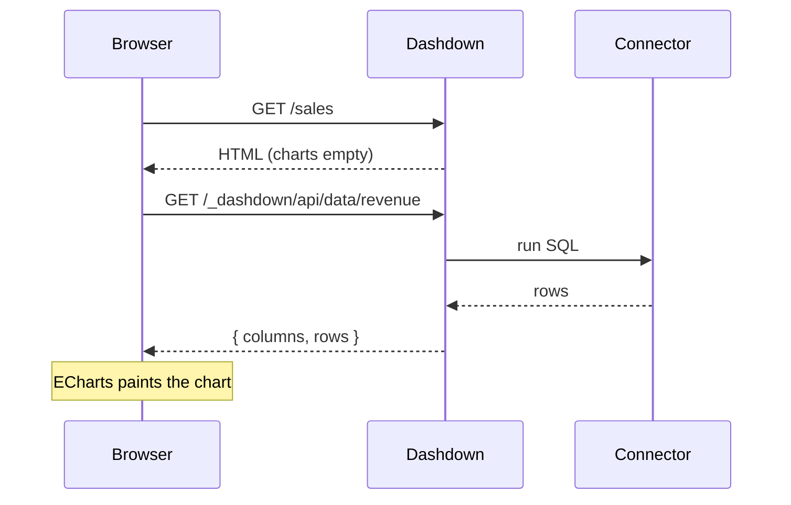

<!-- AUTO-GENERATED from docs/pages/ by tooling/gen-agent-docs.py — do not edit. -->
<!-- Topic: pages. Regenerate with: python tooling/gen-agent-docs.py -->

<!-- source: docs/pages/pages.md -->

# Writing pages

Every file under `pages/` is a route. The Markdown body is rendered with
CommonMark + GitHub-flavored extensions (tables, strikethrough, task lists,
footnotes, definition lists, heading anchors), and fenced code is highlighted
server-side, so it ships as static HTML with no client JS.

## Frontmatter

YAML frontmatter controls the page metadata and its place in the sidebar:

```markdown
---
title: Sales Overview
sidebar_label: Home
sidebar_position: 1
icon: "🏠"
---
```

| Key                | Effect                                            |
| ------------------ | ------------------------------------------------- |
| `title`            | Page title (browser tab, breadcrumb, search).     |
| `sidebar_label`    | Label in the nav tree (defaults to the title).    |
| `sidebar_position` | Sort order within its nav group.                  |
| `icon`             | Emoji/glyph shown next to the nav label.          |

Readers can collapse the sidebar on desktop, and a project with a single page
hides the nav entirely — tune both with the
[`sidebar:` config block](/configuration#sidebar).

## Dynamic pages (`[param]` routes)

A file or directory named `[param]` captures one URL segment as a route
parameter, so a single page serves a whole collection. A file named `[id].md`
matches `/customers/5`, `/customers/42`, … and the captured value is available
to SQL as `${id}`:

```markdown
<!-- pages/customers/[id].md  →  /customers/<id> -->
:::query name=customer connector=main
SELECT customer_id, name, plan, monthly_spend
FROM customers
WHERE customer_id = ${id}
:::

<Table data={customer} />
```

A directory works the same way (`pages/customers/[id]/index.md`), and you can
nest them. Matching prefers the most specific route — an exact file or directory
wins over a `[param]` one. Route params flow through the same context-aware
substitution as every other `${...}`, so they're injection-safe (see
[Queries](/queries#parameters--injection-safety)).

:::tip
To build the full **list → click a row → detail** drill-down (with clickable
table rows via `row_link`), see [Detail pages](/detail-pages) — it has a live demo.
:::

:::note
Dynamic pages have no single enumerable URL, so they're left out of the sidebar
nav and — **by default** — skipped by `dashdown build`. To export them statically,
add a [`static_paths`](/exporting#dynamic-detail-pages-static_paths) frontmatter
block: a query whose rows enumerate the `[param]` values, and the build pre-renders
one page (and one data snapshot) per row. Without it they need the live server (or
a static host that can route a `[param]` template). See [Exporting](/exporting).
:::

## Callouts

Five callout containers are available with the `:::` syntax:

:::note
A `:::note` container — neutral context.
:::

:::tip
A `:::tip` — a helpful aside.
:::

:::warning
A `:::warning` — proceed carefully.
:::

```markdown
:::tip
A helpful aside.
:::
```

## Mermaid diagrams

A ` ```mermaid ` fenced code block renders as an SVG diagram **client-side and
fully offline** — the Mermaid bundle is vendored and lazy-loaded only on pages
that contain a diagram, and every diagram re-themes itself when the reader toggles
light/dark. There is no data API and no CDN, so diagrams render identically on the
dev server, in a `dashdown build` export, and inside an embed. Sequence,
flowchart, entity-relationship, state, class, Gantt, and pie diagrams are all
supported.

For example, this sequence diagram of how a page fetches its data — written as:

````markdown

````

…renders as:


## Images & downloadable files

Add assets to a page and reference them like any Markdown link — they resolve the
same way on the dev server and in a `dashdown build` export.

**Co-located** — drop a file next to the page's `.md` under `pages/` and reference
it **relative to the page**:

```markdown
<!-- pages/report.md  +  pages/chart.png  +  pages/files/2024.csv -->


[Download the dataset (CSV)](files/2024.csv)
```

**Shared** — put files used across many pages in the project's `assets/` folder
(served at `/assets/`) and reference them with a leading `/assets/`:

```markdown


<a href="/assets/whitepaper.pdf" download>Download the whitepaper</a>
```

Any file type works — images, PDFs, CSVs, zips. Plain Markdown sizes an image to
its natural width; use raw HTML to control size or force a download:

```markdown

<a href="files/export.zip" download>Download</a>
```

Here is the shared `/assets/dashdown-icon.svg` rendered inline at 56px:


:::note
You write one natural reference; Dashdown rewrites it to the right form for each
target — an absolute URL on the dev server, a root-relative URL (resolved against
the page's `<base>`) in a static export, so it also works when the build is hosted
under a sub-path. Co-located refs are confined to `pages/` and the `.md` source
itself is never served.
:::

## Includes (partials)

Factor shared Markdown into `partials/` and pull it into any page with an
`` directive naming the file (path relative to the project root) —
the call-to-action at the bottom of the [home page](/) is the partial
`partials/cta.md` pulled in this way. Included files are themselves expanded, so
partials can include other partials.
